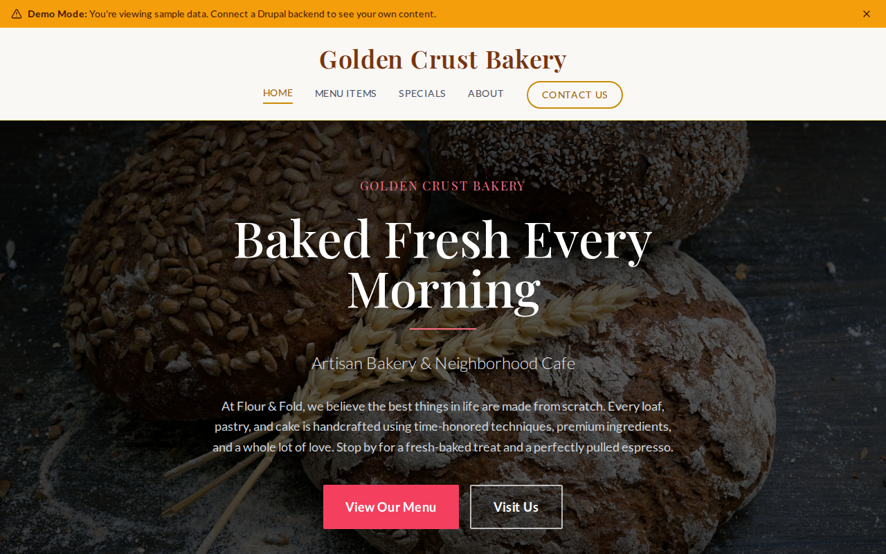

# Decoupled Bakery

A bakery and cafe website starter template for Decoupled Drupal + Next.js. Built for neighborhood bakeries, artisan bread shops, pastry cafes, and custom cake businesses.



## Features

- **Menu Items** - Showcase breads, pastries, cakes, cookies, breakfast items, and cafe drinks with pricing and dietary info
- **Specials** - Promote weekly specials, seasonal offerings, holiday items, and limited-edition creations
- **Custom Orders & Catering** - Static pages for custom cake consultations and event catering menus
- **Modern Design** - Clean, accessible UI optimized for bakery and cafe content

## Quick Start

### 1. Clone the template

```bash
npx degit nextagencyio/decoupled-bakery my-bakery
cd my-bakery
npm install
```

### 2. Run interactive setup

```bash
npm run setup
```

This interactive script will:
- Authenticate with Decoupled.io (opens browser)
- Create a new Drupal space
- Wait for provisioning (~90 seconds)
- Configure your `.env.local` file
- Import sample content

### 3. Start development

```bash
npm run dev
```

Visit [http://localhost:3000](http://localhost:3000)

---

## Manual Setup

If you prefer to run each step manually:

<details>
<summary>Click to expand manual setup steps</summary>

### Authenticate with Decoupled.io

```bash
npx decoupled-cli@latest auth login
```

### Create a Drupal space

```bash
npx decoupled-cli@latest spaces create "My Bakery"
```

Note the space ID returned. Wait ~90 seconds for provisioning.

### Configure environment

```bash
npx decoupled-cli@latest spaces env 1234 --write .env.local
```

### Import content

```bash
npm run setup-content
```

This imports:
- Homepage with hero, stats (500+ items baked daily, 80+ original recipes, 15 years in business, 4.8 Google rating), and custom order CTA
- 6 menu items: Country Sourdough Loaf, Classic Butter Croissant, Dark Chocolate Layer Cake, Almond Biscotti, Avocado Toast, Oat Milk Latte
- 3 specials: Lemon Lavender Scones (seasonal), Mother's Day Celebration Cake (holiday), Friday Night Sourdough Pizza (weekly)
- 2 static pages: About Flour & Fold, Catering & Custom Orders

</details>

## Content Types

### Menu Item
- **price**: Item price display (e.g., "$8.50", "$7.50 / slice")
- **menu_category**: Category taxonomy (Breads, Pastries, Cakes, Cookies, Sandwiches, Coffee & Drinks, Breakfast)
- **dietary_info**: Dietary labels (Vegan, Contains Dairy, Contains Nuts, etc.)
- **is_featured**: Whether the item appears in the featured section on the homepage
- **image**: Photo of the menu item

### Special
- **start_date**: When the special becomes available
- **end_date**: When the special expires
- **special_type**: Type taxonomy (Weekly Special, Seasonal, Holiday, Limited Edition)
- **price**: Price or price range
- **image**: Photo of the special item

### Homepage
- **hero_title**: Main headline (e.g., "Baked Fresh Every Morning")
- **hero_subtitle**: Tagline (e.g., "Artisan Bakery & Neighborhood Cafe")
- **hero_description**: Introductory paragraph
- **stats_items**: Key statistics (items baked daily, recipes, years, rating)
- **featured_items_title**: Section heading for featured menu items
- **cta_title / cta_description**: Custom order call-to-action block

### Basic Page
- General-purpose static content pages (About, Catering, etc.)

## Customization

### Colors & Branding
Edit `tailwind.config.js` to customize colors, fonts, and spacing.

### Content Structure
Modify `data/components-content.json` to add or change content types and sample content.

### Components
React components are in `app/components/`. Update them to match your design needs.

## Demo Mode

Demo mode allows you to showcase the application without connecting to a Drupal backend.

### Enable Demo Mode

```bash
NEXT_PUBLIC_DEMO_MODE=true
```

### Removing Demo Mode

1. Delete `lib/demo-mode.ts`
2. Delete `data/mock/` directory
3. Delete `app/components/DemoModeBanner.tsx`
4. Remove `DemoModeBanner` from `app/layout.tsx`
5. Remove demo mode checks from `app/api/graphql/route.ts`

## Deployment

### Vercel (Recommended)
[](https://vercel.com/new/clone?repository-url=https://github.com/nextagencyio/decoupled-bakery)

### Other Platforms
Works with any Node.js hosting platform that supports Next.js.

## Documentation

- [Decoupled.io Docs](https://www.decoupled.io/docs)
- [Next.js Documentation](https://nextjs.org/docs)
- [Drupal GraphQL](https://www.decoupled.io/docs/graphql)

## License

MIT
